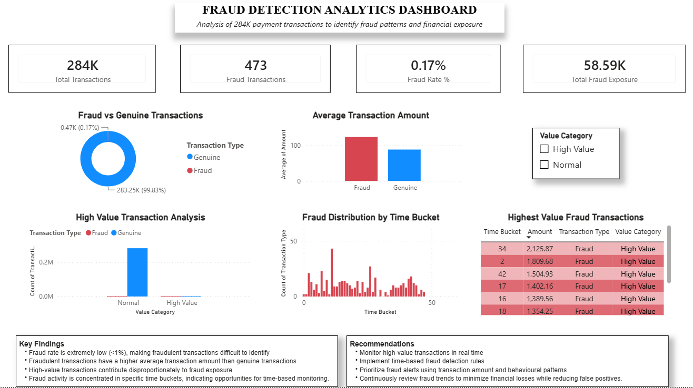

# Fraud Detection Analytics

## Overview

This project analyzes payment transaction data to identify fraud patterns and generate business insights using Python, PostgreSQL, and Power BI.

The objective is to support fraud risk teams by identifying suspicious transaction behavior, measuring fraud exposure, and visualizing fraud trends.

---

## Business Problem

Payment companies process millions of transactions every day. Detecting fraudulent transactions quickly is critical to reducing financial losses while minimizing false positives.

This project demonstrates an end-to-end analytics workflow to support fraud monitoring.

---

## Tech Stack

- Python
- Pandas
- PostgreSQL
- Power BI
- SQL

---

## Dataset

- Source: Kaggle – European Credit Card Fraud Detection Dataset
- Transactions: 284,807
- Fraud Cases: 492 (original dataset)
Due to GitHub file size limitations, the dataset is not included in this repository.

You can download it here:
https://www.kaggle.com/datasets/mlg-ulb/creditcardfraud

---

## Project Workflow

1. Data Cleaning using Python
2. Feature Engineering (High Value Flag, Time Bucket, Transaction Categories)
3. SQL Analysis
4. Dashboard Development in Power BI
5. Business Insights & Recommendations

---

## Dashboard



---

## Power BI Dashboard

The dashboard preview is available in the `images` folder.

The Power BI (.pbix) file is not included due to GitHub file size limitations.

---

## KPIs

- Total Transactions
- Fraud Transactions
- Fraud Rate
- Total Fraud Exposure

---

## Key Insights

- Fraud rate is approximately 0.17%.
- Fraudulent transactions have a higher average transaction amount.
- High-value transactions contribute significantly to fraud exposure.
- Fraud activity is concentrated within specific time buckets.

---

## Business Recommendations

- Monitor high-value transactions.
- Build time-based fraud detection rules.
- Prioritize high-risk alerts.
- Continuously review fraud patterns.

---

## Repository Structure

```text
fraud-detection-analytics/
│
├── data/
├── notebooks/
├── sql/
├── dashboard/
├── images/
├── README.md
├── findings.md
└── requirements.txt
```

---

## Author

Yash Garg